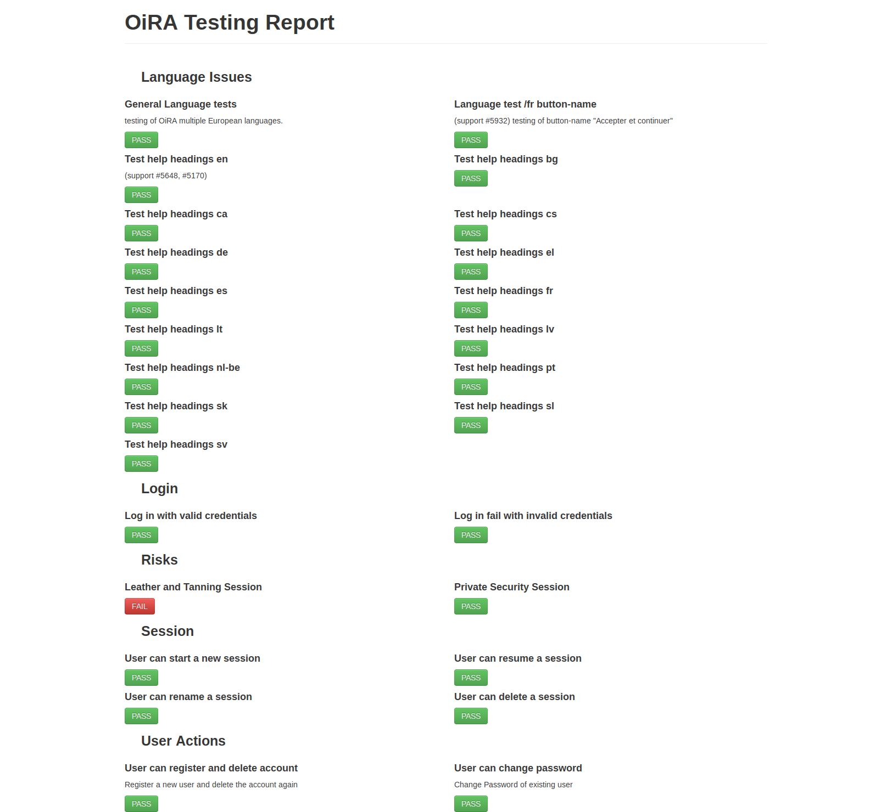
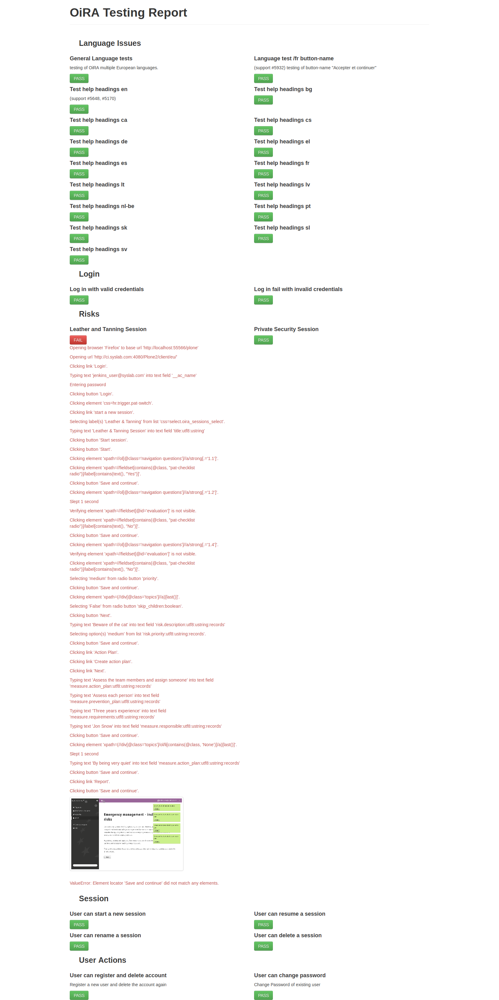
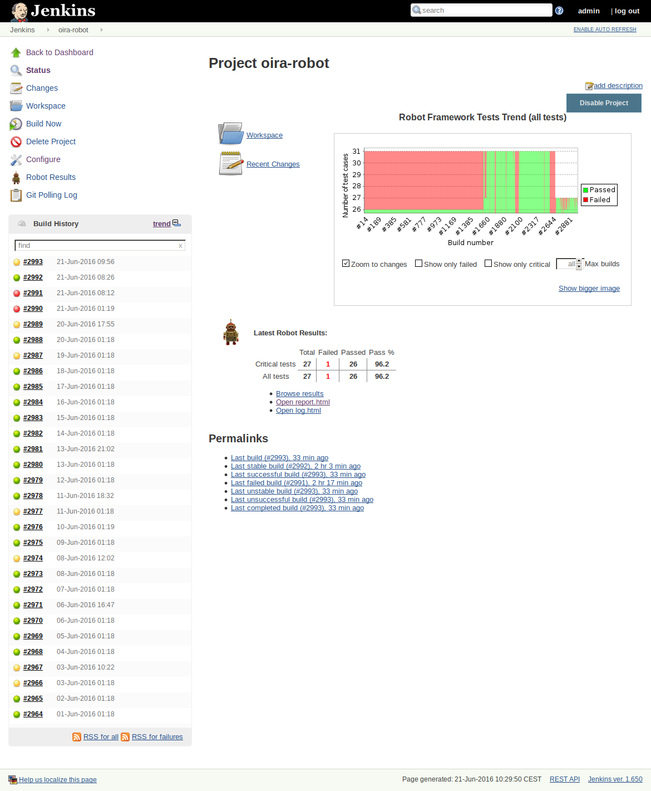
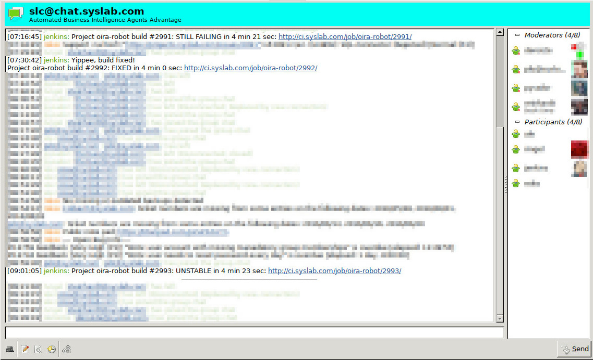

Implementation
==============

This section contains a low level documentation of the code - modules, classes, methods and functions.

.. toctree::
   :maxdepth: 2

   Euphorie <euphorie/index>
   oira/index

Coding conventions
==================

.. note::

    These conventions are derived from `an_example_pypi_project <http://packages.python.org/an_example_pypi_project/>`_.

Every code file should have inline documentation that can be parsed like this:

.. code::

    """
    .. module:: useful_1
       :platform: Unix
       :synopsis: A useful module indeed.

    .. moduleauthor:: Andrew Carter <andrew@invalid.com>

    """

    def public_fn_with_sphinxy_docstring(name, state=None):
        """This function does something.

        .. note::

           An example of intersphinx is this: you **cannot** use :mod:`pickle` on this class.

        A really great idea.  A way you might use me is

        >>> print public_fn_with_googley_docstring(name='foo', state=None)
        0

        BTW, this always returns 0.  **NEVER** use with :class:`MyPublicClass`.

        :param name: The name to use.
        :type name: str.
        :param state: Current state to be in.
        :type state: bool.
        :returns:  int -- the return code::

              0 -- Success!
              1 -- No good.
              2 -- Try again.

        :raises: AttributeError, KeyError

        """
        return 0

Automated Testing
=================

Automated tests are essential for successful software development. Test
automation saves time and effort compared to manual testing because once a test
is implemented it can be run over and over again without human intervention. It
is superior in its repeatability and the comparability of test results because
result and reporting formats are clearly defined and there is no chance of
human error. It also scales a lot better as processing capacity is easier to
increase and decrease than a human testing team.

OiRA is tested at multiple levels: *unit tests* ensure working code on class
level; *integration tests* make sure the individual units work together
correctly; and *functional tests* verify that the system as a whole behaves as
required.

The `python unittest`_ module provides base classes and tools not only for unit
testing but also for the integration test level. Unit and integration tests are
run by `zope.testing.testrunner`_ (via the buildout recipe `zc.recipe.testrunner`_).

Functional tests are implemented with `Robot Framework`_ and its
`Selenium2Library`_ which uses the `Selenium WebDriver`_. Robot Framework's
keyword-driven testing approach allows tests to be written in natural language
which makes them easy to read and understand with minimal technical knowledge.

An actual example of one of OiRA's robot tests is::

    User can start a new session
        Given I am logged in as a user in OiRA EU
        When I start a new session  Leather & Tanning
        Then I land on the preparation screen

The keyword implementation translates the descriptive text to concrete actions
in the user interface. These are executed inside a real-life browser, making it
possible to test things like Javascript and CSS. This yields the most relevant
test results possible.

A concise report shows the result of a test run at a glance:

In case of a test failure technical details and a screen shot of the page where
the failure occurred can be shown with a click:

Automated tests are only useful if they are run, and run regularly. *Continuous
Integration* (CI) ensures early discovery of breaking changes. The automation
server `Jenkins`_ monitors the code repositories. Every time a change is
committed it builds the complete OiRA system and runs the functional tests.

Developers are notified of the test status via email and chat and can intervene
immediately if there are test failures.

.. _python unittest: https://docs.python.org/2.7/library/unittest.html
.. _zc.recipe.testrunner:  https://pypi.python.org/pypi/zc.recipe.testrunner
.. _zope.testing.testrunner: https://pypi.python.org/pypi/zope.testing
.. _Jenkins: https://jenkins.io/
.. _Robot Framework: http://robotframework.org/
.. _Selenium2Library: https://github.com/robotframework/Selenium2Library
.. _Selenium WebDriver: http://docs.seleniumhq.org/docs/03_webdriver.jsp
